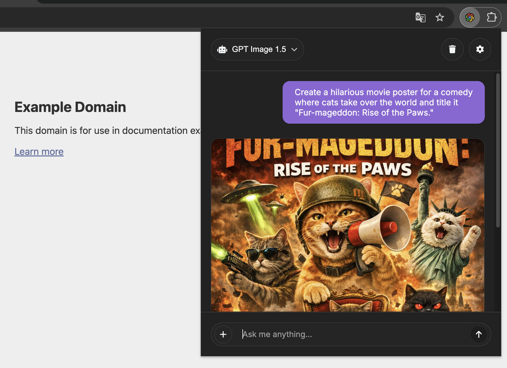

# OpenAI ChatGPT Chrome Extension

This extension uses the magic of OpenAI's chat and image models to ensure a seamless ChatGPT-Like experience - all without ever having to leave your favorite website. Start a A.I. powered conversation or generate stunning images with just a few clicks.

    
    

## Getting started
    
1. Clone the extension or download the latest release.
2. Open the Chrome browser and navigate to the "chrome://extensions" URL.
3. Enable the developer mode by clicking the toggle switch in the top right corner of the page.
4. Click on the "Load unpacked" button and select the cloned extension folder.
5. The options page automatically opens where you need to enter your own OpenAI API-Key.
    
The extension should now be installed and ready to use. The Extension can be opened by clicking on the ChatGPT icon in the top right corner of your browser.

## Features

 - Easy access to the OpenAI language and images models without leaving your favorite website
 - Seamlessly switch between different models
 - Copy the generated text with one click
 - Download the generated image with one click
 - API-Key is safely stored in the browser's local storage and never leaves your device

## Note

For the extension to work, you need to have an OpenAI API-Key. You can get one by signing up on the [OpenAI website](https://openai.com/). Once you have an API-Key, you can enter it in the options page of the extension.
