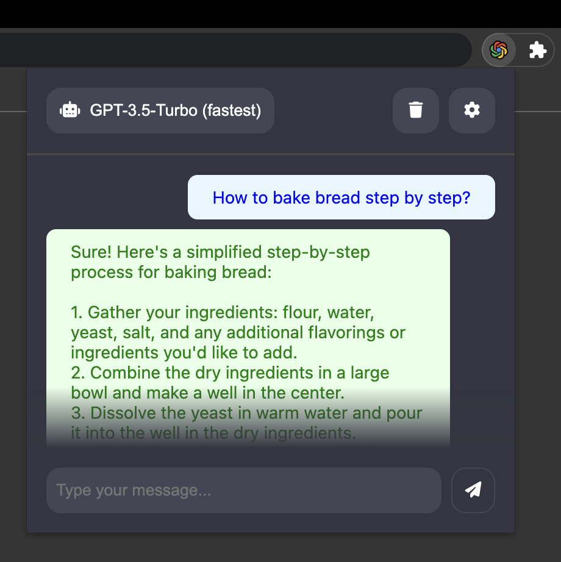

# OpenAI ChatGPT Chrome Extension

This extension uses the magic of OpenAI's GPT language models to ensure a seamless ChatGPT experience, enabling you to pose questions or make statements and receive instant model-generated responses — all without leaving your favorite website.

## Getting started
    
1. Clone the extension or download the latest release.
2. Open the Chrome browser and navigate to the "chrome://extensions" URL.
3. Enable the developer mode by clicking the toggle switch in the top right corner of the page.
4. Click on the "Load unpacked" button and select the cloned extension folder.
5. The options page automatically opens where you need to enter your own OpenAI API-Key.
    
The extension should now be installed and ready to use. The Extension can be opened by clicking on the ChatGPT icon in the top right corner of your browser.

## Features

 - Easy access to the OpenAI ChatGPT language models from any website
 - Seamlessly switch between the different language models
 - Copy the generated text with one click
 - API-Key is stored locally on your machine

## Note

For the extension to work, you need to have an OpenAI API-Key. You can get one by signing up on the [OpenAI website](https://openai.com/). Once you have an API-Key, you can enter it in the options page of the extension.
